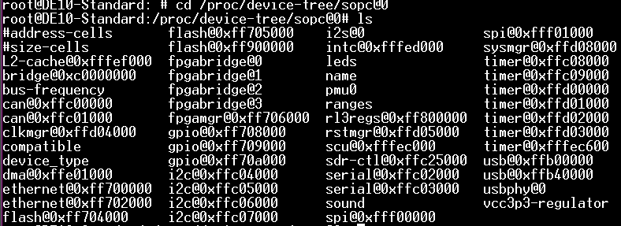

# Linux Embarque ENSEA

# TP1 Prise en main Linux
## On flash l'image sur la carte SD

```
root@DE10-Standard:~# df -h
Filesystem      Size  Used Avail Use% Mounted on
/dev/root       3.0G  1.3G  1.5G  47% /
devtmpfs        375M     0  375M   0% /dev
tmpfs           376M  4.0K  376M   1% /dev/shm
tmpfs           376M  9.8M  366M   3% /run
tmpfs           5.0M  4.0K  5.0M   1% /run/lock
tmpfs           376M     0  376M   0% /sys/fs/cgroup
tmpfs            76M  4.0K   76M   1% /run/user/0
```

Apres un ifconfig on obtient l'IP suivant : 192.168.88.68
On réalise la connecion avec la carte en SSH via teraterm (Baud 115200) ou sinon avec la commande :
```
ssh root@192.168.88.68
```
On recupere les informations CPU avec la ligne de commade suivante : 
```
root@DE10-Standard:/proc# cat cpuinfo
processor       : 0
model name      : ARMv7 Processor rev 0 (v7l)
BogoMIPS        : 200.00
Features        : half thumb fastmult vfp edsp thumbee neon vfpv3 tls vfpd32
CPU implementer : 0x41
CPU architecture: 7
CPU variant     : 0x3
CPU part        : 0xc09
CPU revision    : 0

processor       : 1
model name      : ARMv7 Processor rev 0 (v7l)
BogoMIPS        : 200.00
Features        : half thumb fastmult vfp edsp thumbee neon vfpv3 tls vfpd32
CPU implementer : 0x41
CPU architecture: 7
CPU variant     : 0x3
CPU part        : 0xc09
CPU revision    : 0

Hardware        : Altera SOCFPGA
Revision        : 0000
Serial          : 0000000000000000
```

Lorsque l'on va voir les fichiers dans /proc/ioport on ne trouve rien car dans le fonctionnement de ARM les fichiers ioport n'existent pas contrairement a un PC
Cependant  voici le resutlat obtenus quand on fouille dans /proc/iomem
```
root@DE10-Standard:/proc# cat iomem
00000000-2fffffff : System RAM
  00008000-009d5393 : Kernel code
  00a62000-00b0bd4f : Kernel data
ff200000-ff20001f : /sopc@0/i2s@0
ff200020-ff20003f : /sopc@0/i2s@0
ff201000-ff201007 : /sopc@0/bridge@0xc0000000/sysid@0x100001000
ff231000-ff23107f : /sopc@0/bridge@0xc0000000/vip@0x100031000
ff235000-ff23501f : /sopc@0/bridge@0xc0000000/spi@0x100035000
ff250000-ff25001f : /sopc@0/bridge@0xc0000000/i2c-ocores@0x100050000
ff252000-ff25201f : /sopc@0/bridge@0xc0000000/i2c-ocores@0x100052000
ff254000-ff25401f : /sopc@0/bridge@0xc0000000/i2c-ocores@0x100054000
ff256000-ff25601f : /sopc@0/bridge@0xc0000000/spi@0x100056000
ff258000-ff25801f : /sopc@0/bridge@0xc0000000/i2c-ocores@0x100058000
ff702000-ff703fff : /sopc@0/ethernet@0xff702000
ff704000-ff704fff : /sopc@0/flash@0xff704000
ff706000-ff706fff : axi_slave0
ff708000-ff7080ff : /sopc@0/gpio@0xff708000
ff709000-ff7090ff : /sopc@0/gpio@0xff709000
ff70a000-ff70a0ff : /sopc@0/gpio@0xff70a000
ffb40000-ffb7ffff : /sopc@0/usb@0xffb40000
ffb90000-ffb900ff : axi_slave1
ffc02000-ffc0201f : serial
ffc04000-ffc040ff : /sopc@0/i2c@0xffc04000
ffc05000-ffc050ff : /sopc@0/i2c@0xffc05000
ffd02000-ffd020ff : /sopc@0/timer@0xffd02000
ffd05000-ffd050ff : /sopc@0/rstmgr@0xffd05000
ffe01000-ffe01fff : /sopc@0/dma@0xffe01000
  ffe01000-ffe01fff : /sopc@0/dma@0xffe01000
fff00000-fff000ff : /sopc@0/spi@0xfff00000
fff01000-fff010ff : /sopc@0/spi@0xfff01000
```
```
root@DE10-Standard:/proc/device-tree/sopc@0# ls
#address-cells       dma@0xffe01000       fpgamgr@0xff706000  leds                sound              timer@0xfffec600
#size-cells          ethernet@0xff700000  gpio@0xff708000     name                spi@0xfff00000     usb@0xffb00000
L2-cache@0xfffef000  ethernet@0xff702000  gpio@0xff709000     pmu0                spi@0xfff01000     usb@0xffb40000
bridge@0xc0000000    flash@0xff704000     gpio@0xff70a000     ranges              sysmgr@0xffd08000  usbphy@0
bus-frequency        flash@0xff705000     i2c@0xffc04000      rl3regs@0xff800000  timer@0xffc08000   vcc3p3-regulator
can@0xffc00000       flash@0xff900000     i2c@0xffc05000      rstmgr@0xffd05000   timer@0xffc09000
can@0xffc01000       fpgabridge@0         i2c@0xffc06000      scu@0xfffec000      timer@0xffd00000
clkmgr@0xffd04000    fpgabridge@1         i2c@0xffc07000      sdr-ctl@0xffc25000  timer@0xffd01000
compatible           fpgabridge@2         i2s@0               serial@0xffc02000   timer@0xffd02000
device_type          fpgabridge@3         intc@0xfffed000     serial@0xffc03000   timer@0xffd03000
```
## Hello, Wolrd ! 
On crée un fichier .c dans VScode qui fait un "Hello, World !". Celui ci est compilé dans la machine virtuel
```
arm-linux-gnueabihf-gcc hello.c -o hello.o
```
Pour la transmettre de la VM a la carte Altera on utilise cette commande :
```
scp chemin_sur_VM root@IP_DE_LA_CARTE_SOC:chemin_sur_SOC
```
Une fois ces commandes nous avons comme résutlat :
```
root@DE10-Standard:~/Desktop# ./helloworld.o
Hello, World!
```

## Creation d'un chenillard

De la même manière que pour le Hello, World ! on crée un fichier .c qui vient modifier les fichiers FPGA de la carte. On écrit "1" ou "0" dans ces fichiers afin de modifier l'état de la LED selectionnée.
la commande pour cela est la suivante : 
```
echo "1" > /sys/class/leds/fpga_ledX/brightness
```
Avec X  qui est le numéro de la LED
Voir le code du chenillard dans le dossier "Dossier Partage" pour plus de détail.
Lorsque que l'on excecute de fichier compilé nous écrivions : 
```
./chenillard.o &
```

Cela a pour but d'excuter le programme dans un processus sans interompre toute la carte.
Dans ce code, nous faisons un printf du code PID afin de pouvoir mettre en arret le processus.

# TP2 Modules Kernel
## Acces aux regsitres
On utilise la fonction mmap() afin d'acceder à la mémoire virtuelle ce qui donne acces aux regsitres de la carte. Le programme suivant permet d'allumer une led en passant par les registres.
```
#include <stdio.h>
#include <stdlib.h>
#include <fcntl.h>
#include <sys/mman.h>
#include <stdint.h>

#define GPIO_LED_ADDR 0xFF203000

int main(void)
{
    uint32_t * p;
    int fd = open("/dev/mem", O_RDWR);
    p = (uint32_t*)mmap(NULL, 4, PROT_WRITE|PROT_READ, MAP_SHARED, fd, GPIO_LED_ADDR);
    *p = (1<<6);
}
```
L'utilisation de la fonction mmap() pour accéder directement aux registres depuis l'espace utilisateur présente certains problèmes et limites :

  - Sécurité : L'accès direct aux registres peut potentiellement compromettre la sécurité du système, car cela contourne les mécanismes de protection du noyau d'exploitation.
  - Portabilité : L'utilisation de mmap() pour accéder aux registres est spécifique à une plateforme donnée. Le code ne sera pas portable sur d'autres systèmes d'exploitation ou architectures matérielles.
  - Complexité : L'accès direct aux registres nécessite une connaissance approfondie de l'architecture matérielle et des registres spécifiques à utiliser. Cela peut rendre le code plus complexe et difficile à maintenir.
  - Dépendance au noyau : L'utilisation de mmap() nécessite des privilèges d'accès au noyau, ce qui peut limiter l'utilisation du code dans des environnements restreints ou sur des systèmes embarqués.

## Compilation de module noyau sur la VM

Pour utiliser le Makefile il suffit de taper la commande suivante dans le terminal
```
make
```
Cela crée un fichier .ko, dans notre cas hello.ko executable depuis le noyau. Pour cela nous tappons dans le terminal la commande :
```
sudo insmod hello.ko
```
Lorsque on va voir les messages du noyaux depuis son démarrage avec la commande :
```
sudo dmesg
```
On observe notre message *Hello, World!*


Pour passer des paramètres dans le module nous avons écrit le code suivant :
```
static int param;
module_param(param, int, 0);
MODULE_PARM_DESC(param, "Un paramètre de ce module");

static int __init le_module_init(void) {
    printk(KERN_INFO "Hello world!\n");
    printk(KERN_DEBUG "le paramètre est=%d\n", param);
    return 0;
}

```
*moduleparam()* permet d'ajouter un parametre au module. *MODUL_PARM_DESC()* donne la description du paramètre du module.
Pour le timer le code est deja donné, son implémentation se fait avec un callback()
Après execution les messages renvoyés sont : 


## Hello, World! avec Makefile
Pour cette partie nous ajoutons le module *Hello, World!* au Kernel, pour cela on intègre au Makefile le fichier *hello.o*. En faisant make nous obtenons le fichier .ko que nous déplacons dans la carte soc-fpga. Une fois sur la carte avec la commande insmod on lance l'execution du module *hello.ko*. Nous allons voir les messages de la carte et le resultat obtenus est le suivant :


Après supréssion du module : 


# TP3 Device tree
## Module accedant aux LEDs

Pour acceder aux leds avec le driver, nous modifions les paramètere du devise tree par les commandes suivantes : 
```
ledr: gpio@0x100003000 {
compatible = "altr,pio-16.1", "altr,pio-1.0";
reg = <0x00000001 0x00003000 0x00000010>;
clocks = <&clk_50>;
par :
ledr: ensea {
compatible = "dev,ensea";
reg = <0x00000001 0x00003000 0x00000010>;
clocks = <&clk_50>;
```

  - leds_probe configure les ressources mémoire pour le périphérique de LEDs, initialise les LEDs, enregistre un périphérique misc pour l'interaction en espace utilisateur, et stocke les données spécifiques du périphérique pour un accès futur.
  - read permet de lire la valeur d'une led
  - write permet d'écrire une valeur a une led
  - remove supprime l'instance d'une led
    



# Fin


